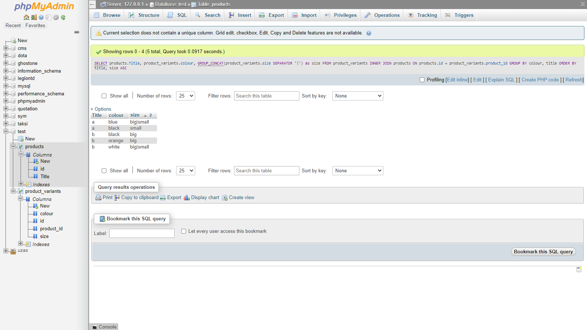

# XML_Bash_SQL
This application is example of how to use xml loader and how to fetch data. It also includes * *.CSV* * file building.
This application can also be accessed by sending 2 agruments through [Bash script](docs/script.sh).

Two examples of reading XML:
- [XML Read from file](index.php)
- [XML Read from xml string](indexstring.php)





``` SELECT (SELECT products.Title FROM products WHERE products.id = product_variants.product_id) AS title, colour, (SELECT GROUP_CONCAT(size SEPARATOR '|')) AS size FROM product_variants GROUP BY colour, title ORDER BY title, size, colour ```
